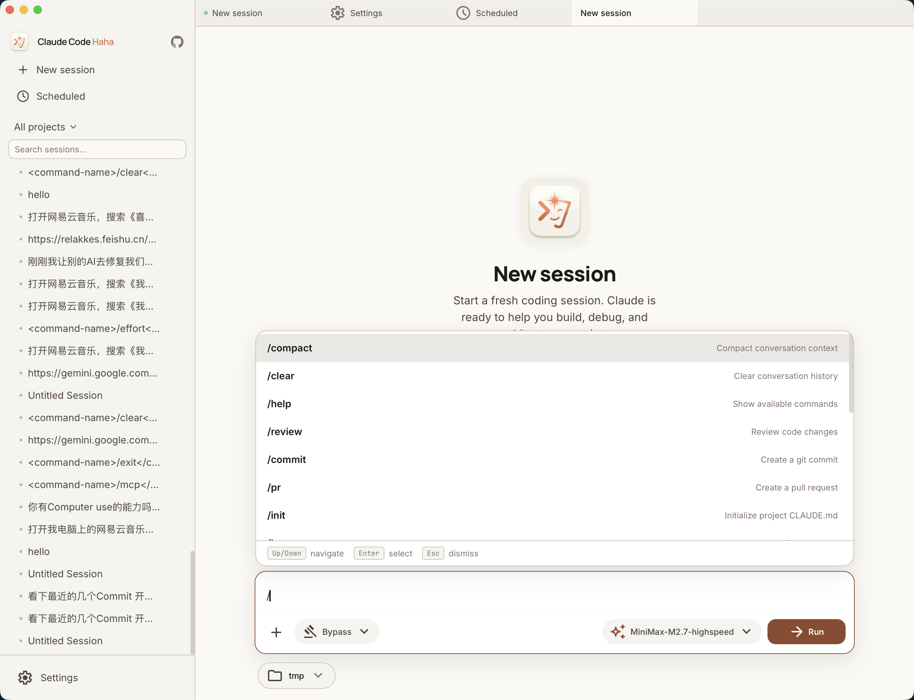
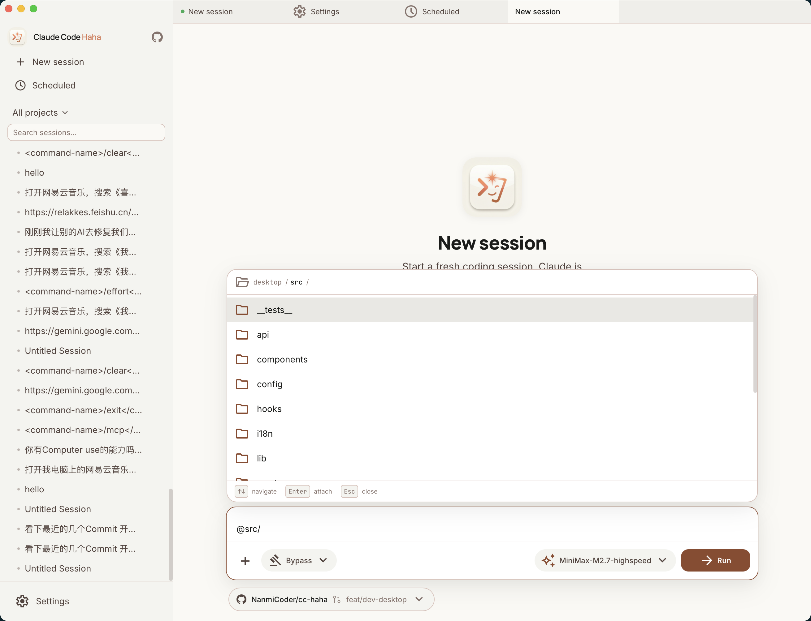
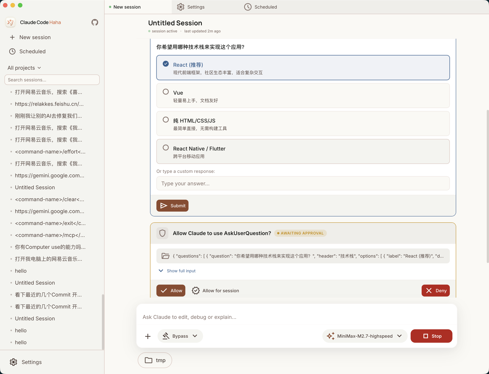

# Gaster Code 桌面端 — 快速上手

> 当前稳定版本：V 1.0.7。桌面端支持 G-Master API 登录、注册、余额充值、订阅管理、官方默认服务商同步、GPT Image 2 异步绘图、可信 H5 手机访问、会话批量整理、Git 感知 `@` 文件引用、Project Memory 管理、`/goal` 目标跟踪、Agent 进度展示、更新代理、便携模式、Windows 终端设置，以及第三方 Skills 与用户 Agents 的安装可见性和刷新重扫。复杂绘图提示词会原样提交。

<p align="center">
<a href="#一界面布局">界面布局</a> · <a href="#二对话操作">对话操作</a> · <a href="#三多标签系统">多标签系统</a> · <a href="#四权限控制">权限控制</a> · <a href="#五项目管理">项目管理</a> · <a href="#六模型与提供商">模型与提供商</a> · <a href="#七绘图">绘图</a> · <a href="#八远程控制适配器">远程控制</a> · <a href="#九定时任务">定时任务</a>
</p>

---

## 一、界面布局


桌面端采用**三栏 + 标签页**的经典 IDE 布局，从左到右分为：

| 区域 | 位置 | 功能 |
|------|------|------|
| **侧边栏** | 左侧 | 会话列表、项目筛选、搜索、导航入口 |
| **标签栏** | 顶部 | 多标签切换、拖拽排序、右键菜单 |
| **内容区** | 中央 | 对话界面 / 工作区文件面板 / 设置页 / 绘图 / 任务页 |
| **状态栏** | 底部 | 当前项目名、模型名称 |

### 侧边栏

侧边栏是你与 Gaster Code 交互的导航中心：

- **品牌区域**：显示「Gaster Code」标识，点击 GitHub 图标跳转仓库
- **操作按钮**：
  - `+` 新建会话
  - 时钟图标 → 定时任务管理
  - 终端图标 → 终端
  - 调色盘图标 → 绘图
  - 齿轮图标 → 设置页面
- **项目筛选器**：按工作目录过滤会话列表
- **搜索框**：实时搜索会话标题（不区分大小写）
- **会话列表**：按时间自动分组 —— 今天 / 昨天 / 最近 7 天 / 最近 30 天 / 更早

**右键菜单**：在会话项上右键可以 **重命名** 或 **删除** 会话。需要整理历史时，也可以进入批量模式，选择多个会话后统一确认删除。

### 状态栏

底部状态栏显示当前会话的项目路径和正在使用的 AI 模型名称，一目了然。

---

## 二、对话操作

### 新建会话

1. 点击侧边栏 `+` 按钮，或使用快捷键 `Cmd/Ctrl + N`
2. 在空白会话页选择**工作目录**（关联本地项目文件夹）
3. 输入第一条消息开始对话

### 发送消息

在底部输入框编写消息：

- **Enter** → 发送消息
- **Shift + Enter** → 换行（多行输入）
- 输入框会自动调整高度（最高 200px）

### 附件上传

桌面端支持多种附件方式：

| 方式 | 操作 |
|------|------|
| **粘贴图片** | 在输入框中 `Cmd/Ctrl + V` 粘贴剪贴板图片 |
| **拖拽上传** | 将文件拖入输入区域 |
| **文件选择** | 点击 `+` 按钮 → 「添加文件」 |

附件会在输入框上方以缩略图画廊展示，支持预览和移除。

### 斜杠命令



输入 `/` 触发命令自动补全菜单：

```
/commit       — 提交代码
/review-pr    — 审查 PR
/memory       — 管理记忆
/debug        — 调试模式
...
```

- **上下箭头** 导航选项
- **Enter / Tab** 确认选择
- **Esc** 关闭菜单
- 命令列表由服务端动态提供，支持搜索过滤

### @ 文件引用



输入 `@` 触发文件搜索菜单，快速将文件或目录引入对话上下文。桌面端会优先使用 Git 感知搜索，遵守 ignore 规则，并在非 Git 目录下自动回退到文件系统搜索：

- 支持路径和文件名自动补全
- 上下箭头导航、Enter 选择

### 消息类型

对话中会展示多种消息类型：

| 类型 | 说明 | 展示形式 |
|------|------|----------|
| **用户消息** | 你发送的文本和附件 | 用户头像 + 消息气泡 |
| **助手消息** | AI 回复内容 | 带边框气泡 + Markdown 渲染 |
| **思考块** | AI 的推理过程（Extended Thinking） | 可展开/折叠，显示思考预览 |
| **工具调用** | Bash、Edit、Read 等工具操作 | 工具图标 + 可展开详情 |
| **工具结果** | 工具执行的输出 | 代码块展示，带成功/错误状态 |
| **权限请求** | 需要用户审批的操作 | 交互式对话框，含允许/拒绝按钮 |
| **AskUser** | AI 向你提问 | 特殊输入框 |

### 流式输出

AI 回复时实时流式展示，支持：

- 打字效果的闪烁光标 `▍`
- 流式代码高亮（使用 Shiki 引擎，VS Code 级别语法着色）
- 随时可点击 **停止** 按钮（或 `Cmd/Ctrl + .`）中断生成

### 消息操作

悬浮在消息上时，右下角出现操作栏：

- **复制** — 复制消息文本内容

---

## 三、多标签系统

桌面端支持同时打开多个对话标签，像浏览器一样管理会话。

### 标签操作

| 操作 | 方式 |
|------|------|
| **新建标签** | `Cmd/Ctrl + N` 或点击 `+` |
| **切换标签** | 点击目标标签 |
| **关闭标签** | 悬浮标签 → 点击 `×` |
| **拖拽排序** | 按住标签拖动到目标位置 |
| **左右滚动** | 标签过多时出现滚动箭头 |

### 标签状态指示

- **绿色脉冲点** → 会话正在运行
- **红色点** → 会话出错
- **无标记** → 会话空闲

### 右键菜单

右键标签打开上下文菜单：

- 关闭当前标签
- 关闭其他标签
- 关闭左侧标签
- 关闭右侧标签
- 关闭全部标签

### 关闭保护

当关闭一个**正在运行的会话标签**时，会弹出确认对话框：

- **继续运行** — 保留标签
- **停止并关闭** — 终止会话后关闭
- **取消** — 放弃操作

标签状态自动保存到 `localStorage`，下次启动时恢复。

---

## 四、权限控制



Gaster Code 在执行文件修改、Shell 命令等操作前，会请求你的权限。

### 权限请求对话框

当 AI 需要执行敏感操作时，会弹出权限请求卡片，显示：

- 工具类型（如 Bash、Edit、Write）
- 操作预览（命令内容、Diff 变更等）
- 详细输入参数（可展开查看）

你可以选择：

| 按钮 | 效果 |
|------|------|
| **允许** | 仅本次允许执行 |
| **一直允许** | 本次会话内自动允许同类操作 |
| **拒绝** | 拒绝本次执行 |

### 四种权限模式

在设置中可切换全局权限模式：

| 模式 | 说明 | 适用场景 |
|------|------|----------|
| **询问权限** (default) | 每个操作都需确认 | 安全第一 |
| **自动接受** (acceptEdits) | 自动允许编辑操作 | 信任文件修改 |
| **计划模式** (plan) | 只展示计划不执行 | 审查方案 |
| **绕过权限** (bypassPermissions) | 全部自动执行 | 完全信任（需二次确认） |

> 切换到「绕过权限」时需要确认警告对话框，防止误操作。

---

## 五、项目管理

每个会话都绑定一个**工作目录**，即你的本地项目文件夹。

### 工作目录

- 新建会话时通过 **DirectoryPicker** 选择工作目录
- 系统自动检测目录是否存在，不存在时显示警告
- 支持 Git 仓库识别，状态栏和会话信息中展示：
  - 仓库名称
  - 当前分支
  - 项目路径

### 项目筛选

侧边栏中的 **ProjectFilter** 组件可按项目过滤会话：

1. 点击项目筛选下拉框
2. 选择目标项目
3. 会话列表仅显示该项目的会话

### 最近项目

通过 API 获取最近使用的项目列表，包含：

- 项目路径和名称
- 是否为 Git 仓库
- 分支名
- 会话数量
- 最后修改时间

### 工作区文件面板

V 0.2.0-gastercode.5 引入右侧工作区文件面板，用于在对话时查看项目文件和变更上下文：

- 浏览当前工作目录的文件树和最近变更文件
- 预览代码、Diff 和图片，不必离开对话标签
- 将文件、片段或评论快速带入输入框上下文
- 配合权限请求和工具结果，定位 AI 即将修改或已经修改的文件

---

## 六、模型与提供商

### 官方 G-Master API 服务商

当前版本默认推荐使用 G-Master API：

- 首次启动点击 **使用 G-Master API 账号登录**，在网页端完成授权。
- 授权成功后，桌面端会自动创建或刷新官方服务商 **G-Master API**。
- API 地址和调用密钥由 G-Master API 下发，桌面端设置页只负责展示状态、刷新权益和模型映射。
- 设置 → **个人设置** 可以查看钱包余额、订阅状态和账单记录，并从桌面端发起充值或订阅。
- 支付确认仍在 G-Master API 的安全收银台页面完成；桌面端不会保存支付密钥或银行卡信息。

### 模型选择

点击状态栏的模型名称，或在设置中打开模型选择器：

- 显示所有可用模型（带图标区分 Opus/Sonnet/Haiku）
- 单选切换当前模型
- 支持 **Effort 级别** 调节：Low / Medium / High / Max

### 自定义模型服务商

如果不使用 G-Master API，可以在设置 → **服务商** 标签页管理自定义模型服务商：

#### 预设提供商

系统内置多种预设，快速配置：

- **Claude 原生接入** — 使用 Claude 官方账号或原生接口
- **OpenAI** — GPT 系列
- **OpenRouter** — 多模型聚合
- **Ollama** — 本地模型
- 其他 Anthropic 兼容服务

#### 配置项

| 字段 | 说明 |
|------|------|
| API Key | 提供商密钥 |
| Base URL | API 基础地址 |
| API 格式 | anthropic / openai_chat / openai_responses |
| 模型映射 | main / haiku / sonnet / opus 对应的实际模型名 |

#### 连接测试

配置完成后可点击 **测试连接**，系统会发送测试请求验证配置是否正确（两步验证：连接性 + 模型可用性）。

---

## 七、绘图

点击侧边栏的**调色盘图标**进入绘图页面。绘图功能通过 G-Master API 官方服务商调用 `gpt-image-2`，需要先完成 G-Master API 登录并保持官方服务商可用。生成请求会优先创建 G-Master API 异步图片任务，再轮询任务结果，避免复杂提示词生成被网关长连接超时截断。

### 使用流程

1. 输入提示词，描述画面主体、风格、光线和氛围。
2. 可点击「增强提示词」调用 G-Master API 的文本模型补充细节与构图描述。
3. 选择图片尺寸：方图、社媒竖图、海报、手机竖屏、横版封面等常用尺寸都可以直接选择。
4. 点击「生成图像」等待返回结果。

生成结果会保存在本机绘图历史中，切换会话后回到绘图页仍可继续查看和下载。图片任务最长等待 15 分钟；如果图片服务响应超时，页面会展示明确提示，稍后可以重新生成。Gaster Code 不会为了规避超时自动压缩或改写你输入的提示词。

---

## 八、远程控制适配器

桌面端不仅提供本地 GUI，还支持通过 **Telegram 和飞书** 远程对话。

### 配置步骤

1. 打开设置 → **远程控制** 标签页
2. 填入平台凭证：
   - **Telegram**：Bot Token
   - **飞书**：App ID + App Secret
3. 配置默认工作目录和允许的用户
4. 启动适配器进程

### 用户配对

为了安全，IM 用户需要通过**配对码**授权：

1. 在桌面端设置中点击「生成配对码」
2. 获取一个 **6 位安全字符码**（60 分钟有效、一次性使用）
3. 在 Telegram/飞书中向 Bot 发送该配对码
4. 配对成功后即可开始对话

安全特性：
- 排除易混淆字符（0/O/1/I/L）
- 同一用户 5 分钟内最多失败 5 次
- 密钥在 API 返回时自动脱敏（仅显示后 4 位）

### IM 内操作

配对成功后，可在 IM 中：

| 命令 | 效果 |
|------|------|
| 直接发文本 | 与 Gaster Code 对话 |
| `/new [项目名]` 或 `新会话` | 开始新会话（支持模糊匹配项目） |
| `/projects` 或 `项目列表` | 查看最近项目 |
| `/stop` 或 `停止` | 停止当前生成 |

权限请求在 IM 中以**按钮卡片**形式展示（Telegram Inline Keyboard / 飞书 Interactive Card），点击即可审批。

---

## 九、定时任务

桌面端支持创建 **Cron 定时任务**，让 Gaster Code 按计划自动执行。

### 进入任务管理

点击侧边栏的**时钟图标**进入定时任务页面。

页面顶部显示统计卡片：总任务数 / 活跃数 / 禁用数。

### 创建任务

点击「新建任务」，填写：

| 字段 | 说明 |
|------|------|
| 任务名称 | 描述性名称 |
| 提示词 | Gaster Code 执行的 Prompt |
| Cron 表达式 | 执行时间计划 |
| 周日期 | 可视化选择执行的星期几 |
| 模型 | 使用的 AI 模型 |
| 权限模式 | 任务执行时的权限策略 |

### 任务管理

每个任务行显示：
- 名称和描述
- Cron 表达式（人性化展示）
- 启用/禁用开关
- 运行历史（可展开查看）
- 手动运行按钮
- 删除按钮

> 注意：定时任务在桌面应用运行时才会执行。

---

## 十、键盘快捷键速查

| 快捷键 | 功能 |
|--------|------|
| `Cmd/Ctrl + N` | 新建会话 |
| `Cmd/Ctrl + K` | 聚焦侧边栏搜索 |
| `Cmd/Ctrl + .` | 停止当前生成 |
| `Escape` | 关闭模态框 |
| `Enter` | 发送消息 |
| `Shift + Enter` | 输入框换行 |
| `/` | 触发斜杠命令菜单 |
| `@` | 触发文件搜索菜单 |

---

## 十一、主题与国际化

### 主题切换

在设置中切换 **浅色 / 深色** 主题。

桌面端采用暖色调设计系统：
- 浅色模式：奶油色背景（#FAF9F5）
- 深色模式：深色背景
- 品牌色：褐红色（#8F482F）

### 国际化

支持 **中文** 和 **英文** 两种语言，在设置 → 通用 中切换。
