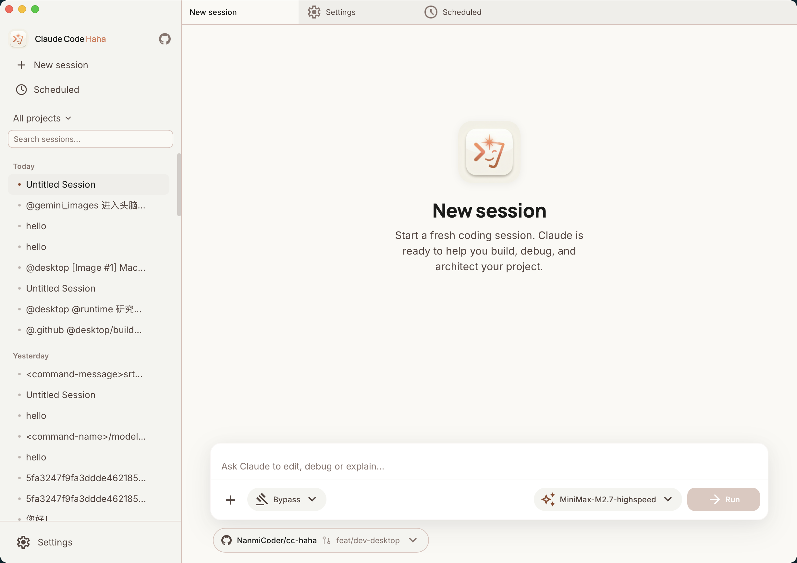

# 桌面端文档

> 图形化的 AI Code Editor，支持多会话、多标签、工作区文件面板、G-Master API 官方服务商、GPT Image 2 绘图和远程控制的完整桌面体验。

---

## 文档目录

### [快速上手](./01-quick-start.md)

面向用户的桌面端使用指南：界面布局、对话操作、多标签、权限控制、项目管理、工作区文件面板、模型配置、绘图、远程控制、定时任务。

### [架构设计](./02-architecture.md)

面向开发者的技术架构：三层架构（Tauri → Server → CLI）、WebSocket 协议、HTTP API、状态管理、协议代理、适配器桥接、目录结构。

### [功能详解](./03-features.md)

深入每个功能模块：聊天引擎、代码展示、工具调用、工作区文件面板、Agent Teams、提供商管理、绘图、技能/Agent、定时任务、远程控制、设计系统。

### [安装指南](./04-installation.md)

下载安装、macOS/Windows 常见问题、Web UI 模式。

### [H5 访问](./06-h5-access.md)

通过局域网或自有反向代理在手机浏览器访问 Gaster Code，并配置 Token、允许来源和安全边界。

---

## 快速开始

### 用户

1. 阅读 [安装指南](./04-installation.md) 下载安装
2. 阅读 [快速上手](./01-quick-start.md) 了解界面和操作
3. 配置 AI 模型提供商，开始对话

### 开发者

1. 阅读 [架构设计](./02-architecture.md) 理解三层架构
2. 关键源码位置：
   - `desktop/src/` — React 前端
   - `desktop/src-tauri/` — Tauri Rust 后端
   - `desktop/sidecars/` — Sidecar 入口
   - `src/server/` — Express API 服务端
   - `adapters/` — 远程控制适配器

---

## 核心概念

| 概念 | 说明 |
|------|------|
| **Tauri** | 跨平台桌面框架，Rust 管理窗口和 Sidecar 进程 |
| **Sidecar** | 随主进程启动的后台服务，运行 API 服务器 |
| **Session** | 一次对话会话，绑定工作目录，通过 WebSocket 通信 |
| **Tab** | 标签页，对应一个 Session 或特殊页面 |
| **Provider** | AI 模型提供商，支持 Anthropic/OpenAI 兼容接口 |
| **Adapter** | 远程控制适配器，Telegram/飞书接入 Gaster Code |
| **Store** | Zustand 状态容器，按领域拆分管理 |
